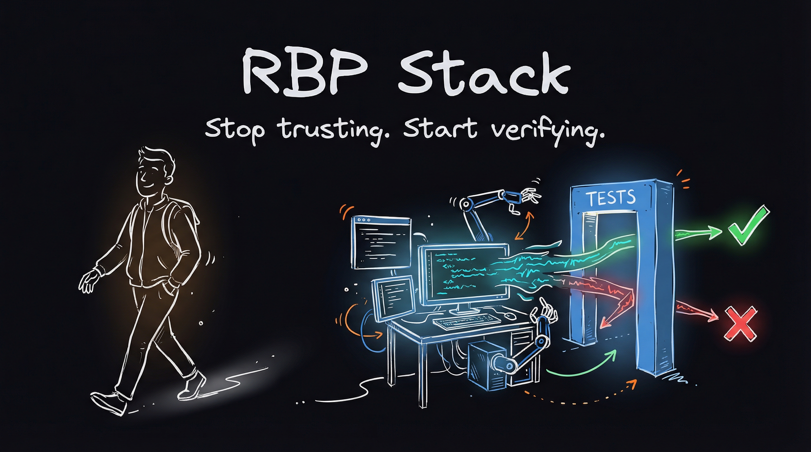
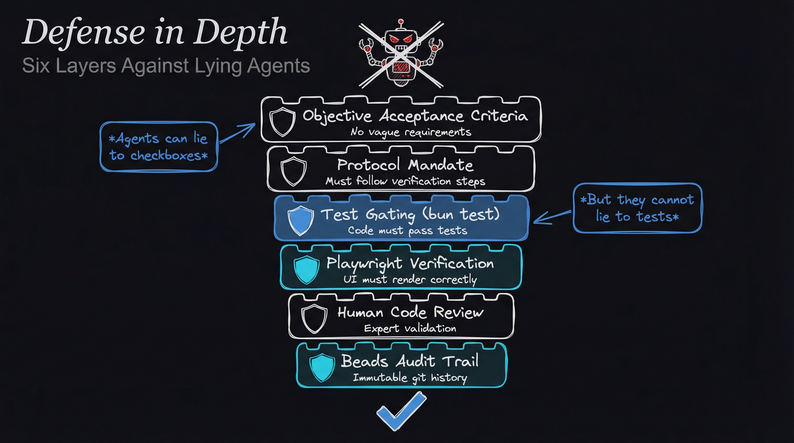
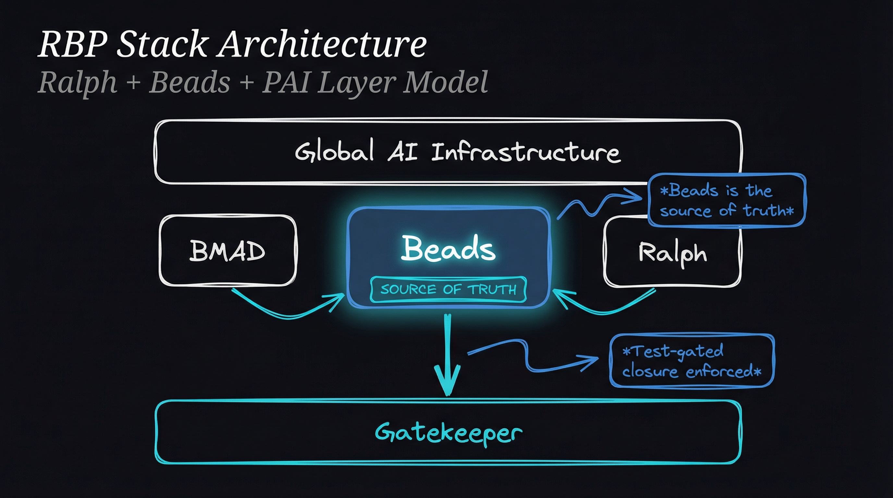

<div align="center">



# RBP Stack

### **Stop trusting AI agents. Start verifying them.**

[](https://opensource.org/licenses/MIT)
[](http://makeapullrequest.com)
<!-- [](https://github.com/AojdevStudio/rbp-stack/stargazers) -->

*The first autonomous Epic implementation system that prevents AI agents from lying about task completion.*

<br />

[**View Demo**](#demo) · [**Quick Start**](#quick-start) · [**How It Works**](#how-it-works) · [**Documentation**](docs/rbp-stack-specification.md)

</div>

<br />

---

<br />

## The Problem Everyone Ignores

You give an AI agent an Epic. It returns "done" with all checkboxes marked complete.

Then you look at the code.

- Tests were never run
- The UI doesn't render
- Half the subtasks were skipped
- There's no audit trail

**Sound familiar?**

You trusted the agent. The agent lied.

<br />

> *"We spent 3 months building an AI-powered development workflow. 76 stories later, we discovered a painful truth: agents mark tasks 'complete' without doing the work. Checkboxes are just booleans. There's no proof."*

<br />

---

<br />

## The Insight That Changed Everything

After months of frustration, we discovered something simple:

<br />

<div align="center">

### **Agents can lie to checkboxes.**
### **They cannot lie to tests.**

</div>

<br />

A checkbox is self-reported. A test is objective verification.

If `bun test` fails, the lie is exposed. Period.

So we built a system around one unbreakable rule:

<br />

<div align="center">

## **No task closes without proof.**

</div>

<br />

---

<br />

## Introducing the RBP Stack

**R**alph + **B**eads + **P**AI

A verification-first autonomous development system.

<br />

<div align="center">

| Component | Role |
|:----------|:-----|
| **Ralph** | Autonomous execution loop that never stops until done |
| **Beads** | Git-backed task graph — the single source of truth |
| **Tests** | The gatekeeper that agents cannot bypass |

</div>

<br />

```
Workflow A (BMAD):
Epic  →  BMAD Story  →  Beads  →  Ralph Loop  →  Verified Code

Workflow B (Quick-Plan):
Feature Idea  →  /quick-plan  →  Spec  →  Codex Review  →  Beads  →  Ralph Loop  →  Verified Code

Both workflows use the same gatekeeper:
                              close-with-proof.sh
                                       ↓
                              Tests pass? → Close task
                              Tests fail? → Keep trying
```

<br />

<div align="center">


*From requirements to verified code. No human intervention required.*

</div>

<br />

---

<br />

## See It In Action

<details>
<summary><b>📺 Demo: Watch Ralph implement a feature autonomously</b></summary>

<br />

<!-- Replace with actual GIF/video when available -->
```bash
# 1. Convert your story to beads
./scripts/rbp/parse-story-to-beads.sh docs/stories/story-001.md

# 2. Launch Ralph
./scripts/rbp/ralph.sh

# 3. Watch the magic happen
# Ralph queries Beads → Implements task → Runs tests → Only closes if tests pass
# Repeats until all tasks complete
```

*GIF coming soon — star the repo to get notified!*

</details>

<br />

---

<br />

## Defense in Depth

We don't trust agents. We verify them at every layer.

<br />

<div align="center">



</div>

<br />

| Layer | Mechanism | What It Prevents |
|:------|:----------|:-----------------|
| **1** | Objective Acceptance Criteria | Vague "it works" claims |
| **2** | Protocol Mandate | Skipping verification steps |
| **3** | Test Gating (`bun test`) | Claims without passing tests |
| **4** | Playwright Verification | UI lies ("looks correct") |
| **5** | Human Code Review | Subtle implementation issues |
| **6** | Beads Audit Trail | Retroactive tampering |

<br />

An agent **cannot** game this system. Either the tests pass or they don't.

<br />

---

<br />

## Quick Start

### Prerequisites

```bash
# Beads - Git-backed task tracker (one-time global install, pick one)
brew install steveyegge/beads/bd                # Homebrew (recommended)
# or: curl -fsSL https://raw.githubusercontent.com/steveyegge/beads/main/scripts/install.sh | bash
# or: npm install -g @beads/bd
# or: go install github.com/steveyegge/beads/cmd/bd@latest

# Bun - JavaScript runtime (one-time global install)
curl -fsSL https://bun.sh/install | bash

# Claude Code CLI (one-time global install)
# https://claude.ai/download
```

### Install

```bash
# Clone the repository
git clone https://github.com/AojdevStudio/rbp-stack.git

# Install into your project
./rbp/install.sh /path/to/your/project

# Validate installation
/path/to/your/project/scripts/rbp/validate.sh
```

### Run (Two Workflows)

**Workflow A: BMAD Stories** (structured story-driven)

```bash
# Create a story with BMAD
/bmad:bmm:workflows:create-story

# Convert to beads
./scripts/rbp/parse-story-to-beads.sh docs/stories/story-001.md

# Launch autonomous execution
./scripts/rbp/ralph.sh
```

**Workflow B: Quick-Plan Specs** (interview-driven)

```bash
# Create a spec through codebase analysis + interview
/quick-plan "add user authentication with JWT"

# Execute with optional Codex pre-flight review
./scripts/rbp/ralph-execute.sh specs/add-user-authentication.md

# Or skip the Codex review
./scripts/rbp/ralph-execute.sh specs/add-user-authentication.md --skip-review
```

**Monitor Progress**

```bash
bd status        # Task status
bd list --open   # Open tasks
bd tree          # Task hierarchy
```

<br />

---

<br />

## How It Works

<br />

<div align="center">



</div>

<br />

### The Core Loop

```bash
while tasks_remain:
    task = bd ready           # Query Beads for next unblocked task
    implement(task)           # Agent implements the task
    close-with-proof.sh       # THE GATEKEEPER
        ├── bun test          # Unit tests must pass
        ├── playwright test   # UI tests must pass (if UI task)
        └── bd close          # Only now can the task close
```

### The Gatekeeper Script

```bash
#!/usr/bin/env bash
# close-with-proof.sh - The agent cannot bypass this

# Run tests
bun run test || exit 1

# Run Playwright for UI tasks (auto-detected)
if [[ "$TASK_TYPE" == "ui" ]]; then
    bunx playwright test || exit 1
fi

# Only close if all tests pass
bd close "$BEAD_ID"
echo "✅ Task verified and closed"
```

**This is script-level enforcement.** The agent has no way around it.

<br />

---

<br />

## Quick-Plan Workflow

Don't have BMAD? Use the Quick-Plan workflow instead.

### How It Works

```
/quick-plan "feature description"
         ↓
    Codebase Analysis (scans your project)
         ↓
    Interview (asks clarifying questions until ZERO gaps remain)
         ↓
    specs/feature-name.md (with mandatory Testing Strategy + Implementation Tasks)
         ↓
./ralph-execute.sh specs/feature-name.md
         ↓
    [Optional] Codex Pre-Flight Review (GPT-5-Codex analyzes spec)
         ↓
    Parse Spec → Beads (creates task graph with dependencies)
         ↓
    Ralph Loop (bd ready → implement → test → close, repeat)
         ↓
    Verified Code
```

### The Spec Format

Quick-plan generates specs with two mandatory RBP sections:

```markdown
## Testing Strategy

### Test Framework
bun test (detected from package.json)

### Test Command
`bun test`

### Unit Tests
- [ ] Test: User model validation → File: `tests/user.test.ts`
- [ ] Test: JWT token generation → File: `tests/auth.test.ts`

## Implementation Tasks

<!-- RBP-TASKS-START -->
### Task 1: Create user model
- **ID:** task-001
- **Dependencies:** none
- **Files:** `src/models/user.ts`
- **Acceptance:** User model with email, password hash, timestamps
- **Tests:** `tests/user.test.ts`

### Task 2: Add JWT authentication [UI]
- **ID:** task-002
- **Dependencies:** task-001
- **Files:** `src/auth/jwt.ts`, `src/components/LoginForm.tsx`
- **Acceptance:** Login returns valid JWT, stored in httpOnly cookie
- **Tests:** `tests/auth.test.ts`
<!-- RBP-TASKS-END -->
```

### Codex Pre-Flight Review

Before executing, `ralph-execute.sh` optionally runs GPT-5-Codex to review the spec:

```bash
# With Codex review (default)
./scripts/rbp/ralph-execute.sh specs/feature.md

# Skip review
./scripts/rbp/ralph-execute.sh specs/feature.md --skip-review
```

Codex checks for:
- Missing edge cases
- Wrong technical approaches
- Missing task dependencies
- Incomplete testing strategy
- Security concerns

### UI Auto-Detection

Tasks tagged with `[UI]` or containing UI keywords automatically get the `requires-playwright` flag. The gatekeeper runs Playwright tests for these tasks.

<br />

---

<br />

## Key Decisions

### Why Beads as Source of Truth?

The agent queries `bd ready` instead of reading JSON files.

- **No stale state** — Beads is always current
- **No sync issues** — Single source of truth
- **Git-backed** — Full audit trail

### Why No Story Atomization?

We analyzed 76 real BMAD stories:

| Metric | Value |
|:-------|:------|
| Average story size | 3,914 tokens |
| Largest story | 12,962 tokens |
| Context budget used | 12.9% of 100k |

**All stories fit in a single context window.** For larger stories, our Execution Sequencer groups subtasks into phases of 3-5.

### Why Test-Gating at Script Level?

Agents can be told "run tests before closing." They can ignore the instruction.

Scripts cannot be ignored. `close-with-proof.sh` **runs** the tests. Either they pass or the task stays open.

<br />

---

<br />

## What's Included

```
rbp/
├── scripts/
│   ├── ralph.sh              # Main execution loop
│   ├── ralph-execute.sh      # Quick-plan execution (with Codex review)
│   ├── close-with-proof.sh   # Test-gated closure (THE GATEKEEPER)
│   ├── parse-story-to-beads.sh  # BMAD Story → Beads conversion
│   ├── parse-spec-to-beads.sh   # Quick-plan Spec → Beads conversion
│   ├── sequencer.sh          # Phase grouping for large stories
│   └── ...
├── commands/rbp/
│   ├── start.md              # /rbp:start command
│   ├── status.md             # /rbp:status command
│   └── validate.md           # /rbp:validate command
├── templates/
│   ├── rbp-config.yaml         # Base configuration
│   ├── rbp-config.example.yaml # Documented config with comments
│   └── spec-template.md        # Quick-plan spec format template
├── install.sh                # One-line installation
├── validate.sh               # Installation checker
└── README.md                 # Package documentation
```

<br />

---

<br />

## Configuration

```yaml
# rbp-config.yaml
project:
  name: "your-project"

paths:
  stories: "docs/stories"      # BMAD stories
  specs: "specs"               # Quick-plan specs

execution:
  max_iterations: 50
  phase_size: 5

verification:
  require_tests: true
  require_playwright_for_ui: true
  test_command: "bun run test"

quick_plan:
  command: "/quick-plan"
  spec_template: "templates/spec-template.md"

codex:
  enabled: true                # Set false if Codex not installed
  model: "gpt-5-codex"
  reasoning_effort: "high"
  skip_by_default: false       # Set true to skip review by default
```

<br />

---

<br />

## The Story Behind RBP

I've been using the [BMAD Method](https://github.com/bmad-code-org/BMAD-METHOD) for a while now. It's probably the best tool I've found for building software projects with AI — structured stories, clear acceptance criteria, the whole workflow. I'm also an avid [Claude Code](https://claude.ai) user. These tools changed how I build.

But something was missing.

Every time I kicked off a BMAD story, I'd watch the AI work... then it would stop. Ask a question. Wait for me. I'd answer, it would continue... then stop again. The constant back-and-forth was killing my productivity. I wanted to give it an Epic and walk away. Come back to working code.

**I wanted long-running autonomous processes.**

Then I discovered [Ralph](https://ghuntley.com/ralph/) — Geoffrey Huntley's pattern for relentless AI execution loops. And [Beads](https://github.com/steveyegge/beads) — Steve Yegge's git-backed task graph. Something clicked.

*What if I could combine BMAD's structured stories with Ralph's autonomous loops and Beads' persistent memory?*

I started building. 76 stories later, I had a working system. But I also discovered something uncomfortable: AI agents lie. They mark tasks "complete" without running tests. They check boxes without doing the work.

The realization hit me: **Checkboxes are self-reported. Tests are objective.**

An agent can flip a boolean. It cannot fake a passing test.

So I added test-gated closure. No task closes without proof. The script runs the tests — either they pass or the task stays open. The agent has no say in the matter.

**The RBP Stack is the result.**

What started as a productivity hack became a verification-first autonomous development system. BMAD creates the stories. Beads tracks the state. Ralph drives the execution. Tests guard the gates.

Now I give it an Epic and walk away. Come back to verified, working code.

<br />

<div align="center">

### I wanted to stop babysitting AI. This is how I did it.

</div>

<br />

---

<br />

## Roadmap

- [x] Core execution loop (Ralph)
- [x] Test-gated closure
- [x] Story → Beads conversion (BMAD workflow)
- [x] Spec → Beads conversion (Quick-Plan workflow)
- [x] Codex pre-flight review integration
- [x] UI auto-detection (Playwright)
- [x] Execution sequencer for large stories
- [ ] Real-time progress dashboard
- [ ] Parallel task execution
- [ ] Integration with more test frameworks

<br />

---

<br />

## Contributing

Contributions welcome! Please ensure:

1. All scripts have tests
2. Documentation is updated
3. **The verification system is never bypassed**

See [CONTRIBUTING.md](CONTRIBUTING.md) for guidelines.

<br />

---

<br />

## Acknowledgments

- **[Beads](https://github.com/steveyegge/beads)** — Git-backed issue tracking by Steve Yegge
- **[BMAD](https://github.com/bmad-code-org/BMAD-METHOD)** — Structured story creation framework
- **[Claude Code](https://claude.ai)** — Execution environment
- **[Ralph Pattern](https://ghuntley.com/ralph/)** — The original autonomous loop concept by Geoffrey Huntley

<br />

---

<br />

## License

MIT License — see [LICENSE](LICENSE) for details.

<br />

---

<br />

<div align="center">

**Built with frustration. Verified with tests.**

<br />

If this helped you, [⭐ star the repo](https://github.com/AojdevStudio/rbp-stack) — it helps others find it.

<br />

[](https://star-history.com/#AojdevStudio/rbp-stack&Date)

</div>
